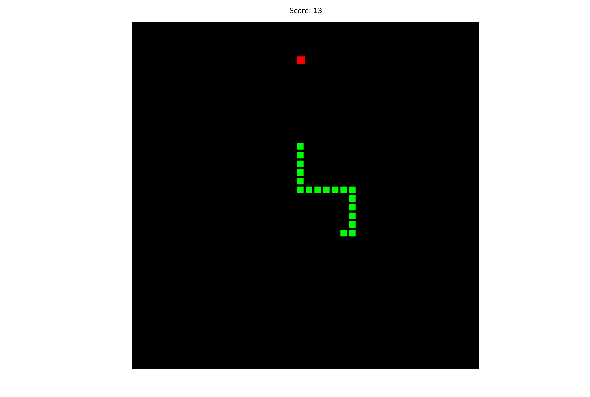

# cycle-snake
A snake game implemented in Cycle.js

## implementation details
Created a custom `game` driver that manipulates the canvas and handles the game.
The only information entering the driver sink is the player velocity information.

## screenshot

